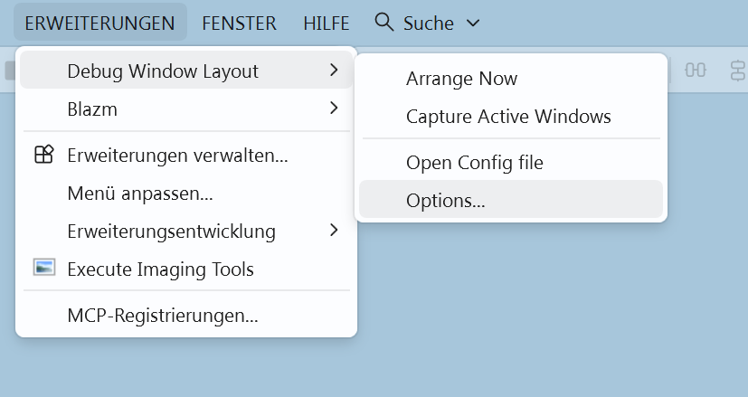
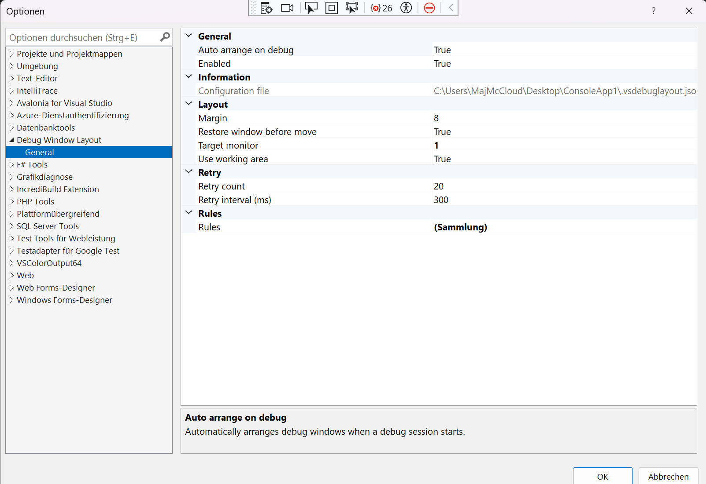

# Debug Window Layout

[](https://github.com/Zevedei-Partner-Ltd/DebugWindowLayout/releases)
[](https://marketplace.visualstudio.com/items?itemName=ZevedeiPartnerLtd.debugwindowlayout)
[](https://marketplace.visualstudio.com/items?itemName=ZevedeiPartnerLtd.debugwindowlayout)

[](https://marketplace.visualstudio.com/items?itemName=ZevedeiPartnerLtd.debugwindowlayout)
[](https://marketplace.visualstudio.com/items?itemName=ZevedeiPartnerLtd.debugwindowlayout)


A small in-process Visual Studio VSIX that automatically arranges windows belonging to processes currently being debugged.

It targets the stable Visual Studio 17.x SDK API surface. Visual Studio 2026 supports 17.x extension APIs and accepts a VSIX installation target with lower bound `17.0`, so the same extension can run in Visual Studio 2022 and Visual Studio 2026.







## Plugin functionality

The **Debug Window Layout** plugin helps when debugging multiple processes in Visual Studio:

- When Visual Studio enters run mode, currently debugged processes are detected automatically.
- Related windows are matched by process ID; for console windows, the extension also uses visible window title matching (fallback for `conhost/OpenConsole`).
- Windows are arranged across monitors and zones based on rules from `.vsdebuglayout.json`.
- If no configuration exists, an automatic grid layout is generated.
- `Extensions > Debug Window Layout > Open Config` opens the configuration file directly in Visual Studio and stores it as formatted (beautified) JSON.

## What it does

- Hooks the debugger `OnEnterRunMode` event.
- Reads all `DTE.Debugger.DebuggedProcesses` PIDs.
- Finds top-level windows owned by those PIDs.
- For console apps, also falls back to matching the visible window title, because the actual HWND may be owned by `conhost.exe` / OpenConsole instead of the debugged EXE.
- Moves/restores windows with Win32 `SetWindowPos`.
- Supports multiple monitors and normalized custom bounds.
- Stores configuration per solution in `.vsdebuglayout.json`.

## Build

Prerequisites on Windows:

1. Visual Studio 2026 (or 2022) with the **Visual Studio extension development** workload.
2. .NET Framework 4.8 targeting pack.

Then either open `DebugWindowLayout.sln` and build Release, or run from PowerShell:

```powershell
.\build.ps1
```

`build.ps1` locates the installed Visual Studio/MSBuild through `vswhere`. To build and immediately open the VSIX installer:

```powershell
.\build-and-install.ps1
```

Alternatively use `build.cmd` from a **Developer Command Prompt for VS 2026**. The VSIX is produced under `src\DebugWindowLayout\bin\Release\`.

## Test the extension

Open the solution and press F5. Visual Studio starts an Experimental Instance with the extension installed.

In the experimental instance, open your normal multi-project solution and start debugging.

## Usage

The extension adds two commands in a dedicated submenu under **Extensions**:

- `Debug Window Layout: Arrange Now`
- `Debug Window Layout: Open Config`

When debugging starts, the extension automatically tries to arrange the visible windows.

### No config file

If `.vsdebuglayout.json` doesn't exist, all matched debug windows are arranged as an automatic grid on `DISPLAY2`. If only one display is available, it falls back to an available display.

### Generate a starter config

Start your four processes, then choose:

`Extensions > Debug Window Layout > Open Config`

If the config file doesn't exist yet, it is generated from the processes currently being debugged. The generated rules are assigned to a grid automatically.

`Open Config` opens `.vsdebuglayout.json` directly inside Visual Studio. The file content is stored in formatted (beautified) JSON for easier editing.

## Recommended console setup

Classic console windows can be owned by `conhost/OpenConsole`, not by your service process. For deterministic matching, give every service a unique console title:

```csharp
Console.Title = "Gateway";
```

and configure both the process and title:

```json
{
  "process": "Gateway",
  "titleContains": "Gateway",
  "zone": "TopLeft"
}
```

For your four-service example:

```json
{
  "enabled": true,
  "autoArrangeOnDebug": true,
  "targetMonitor": 2,
  "margin": 8,
  "rules": [
    { "process": "Gateway",        "titleContains": "Gateway",        "zone": "TopLeft" },
    { "process": "OrderService",   "titleContains": "OrderService",   "zone": "TopRight" },
    { "process": "PaymentService", "titleContains": "PaymentService", "zone": "BottomLeft" },
    { "process": "Worker",         "titleContains": "Worker",         "zone": "BottomRight" }
  ]
}
```

Supported zones:

`Full`, `Left`, `Right`, `Top`, `Bottom`, `TopLeft`, `TopRight`, `BottomLeft`, `BottomRight`.

A rule can override the monitor:

```json
{ "process": "Worker", "monitor": 3, "zone": "Full" }
```

Or use arbitrary normalized coordinates:

```json
{
  "process": "Gateway",
  "monitor": 2,
  "bounds": { "x": 0.0, "y": 0.0, "width": 0.66, "height": 1.0 }
}
```

`monitor` and `targetMonitor` are intended to correspond to Windows `DISPLAY1`, `DISPLAY2`, etc.

## Windows Terminal caveat

If several debugged consoles are tabs inside one Windows Terminal top-level window, Windows exposes only that one top-level HWND for moving. The extension can move the Terminal window, but it cannot independently place its individual tabs. For four independently positioned consoles, launch them as separate external console windows.

## Source layout

- `DebugWindowLayoutPackage.cs` — VSIX package, debugger event and commands.
- `DebugWindowLayoutController.cs` — retry loop, process collection, layout assignment.
- `WindowManager.cs` — HWND discovery and moving.
- `MonitorManager.cs` — monitor enumeration and `DISPLAYn` mapping.
- `LayoutConfig.cs` — solution-local JSON configuration.
